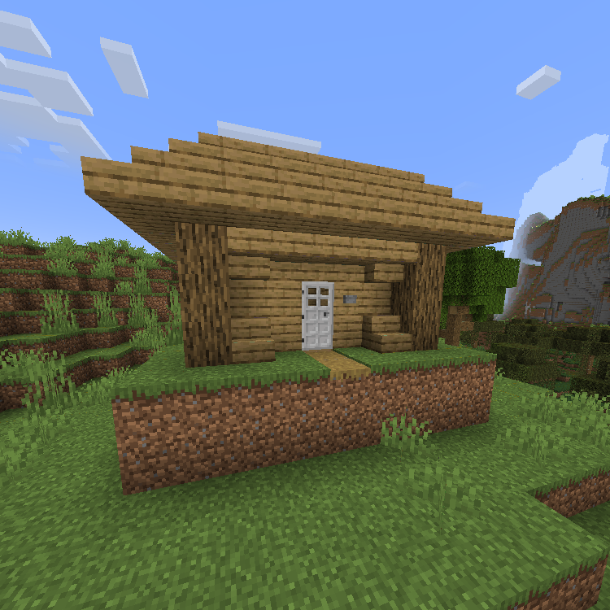
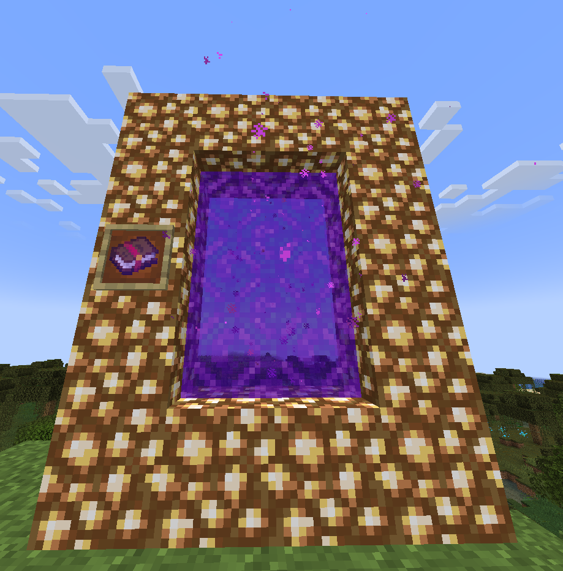

# Features

## Quality of Life

### Bedrock QoL

Bedrock players no longer have an **attack cooldown**.

### Quick Open

Players can now **shift-right-click** to open Ender Chests and Shulker Boxes.

### Instant Brewing

Brewing stands will now instantanously brew potions without fuel.

## Features

### Hardcore Mode

**Hardcore Mode** is an optional challenge which can be enabled with `/hardcore` in-game.
This challenge is *per-player* and does not affect other players.

When enabled, the following changes are made:

- Natural regeneration is disabled
- Environmental damage taken is tripled
- Dying will result in an inventory, ender chest, and experience wipe
- Maximum health is increased to 40HP (20 hearts total)
- Player [debuffs](#armor-debuff) are disabled
- Special reward drops are enabled

This challenge lasts a total of **100 real-life hours** and ***cannot be disabled*** after enabling. You either survive the challenge, or die trying.

Completing hardcore mode will grant the player the following rewards:

- Breaking blocks rewards experience points

### New Structures

New structures have been added to the game, including:

- The **Light Shack** 

### New Dimensions

New dimensions have been added to the game, including:

- The [**Realm of Light**](#the-realm-of-light)

## Overhauls

### Trial Chambers

Trial Chambers have been made more difficult, through the use of **Trial Omen**.

Unlike in vanilla, entering a Trial Chamber with **Trial Omen** will spawn heavily-geared monsters which will do a lot of damage.

The following changes were made for *Ominous Trial Chambers*:

- Block breaking/placing is disabled
  - Exceptions include: TNT and Water
- Natural regeneration is disabled
  - !! *You can only heal with Regeneration or Instant Health!* !!
- Monsters are infinitely stronger
  - Zombmies will spawn with Strength and wield an enchanted Diamond Sword
  - Skeletons will wield an enchanted Bow
  - Spiders will spawn with Speed and Strength
  - ...and more!

### Beacons

Beacons have received an entire overhaul, with new effects and mechanics.

New features include:

- Infinite block storage
- Up to 3 effects at once
  - Effects can be stacked to create effects of potency 3
- Special inner-radius effects
  - Disable mob spawning
  - Disable tool durability
- Upgrades
  - In-radius flight (Flight Crystal)
  - Mass block-breaking (Plot Purger PRO)
  - Teleportation (Eye of Teleportation)
  - Stackable item duplication (Pixel Printer 3000)
  - WorldEdit-like functionality (Builders' Grace)

---

See the recipe to craft an **Advanced Beacon** [here](recipes#advanced-beacon).

## Balancing

### Armor Debuff

When standing near players with similar armor, you will **lose 1 heart** temporarily

Conditions

|                  | Diamond (you)              | Netherite (you) |
|------------------|----------------------------|-----------------|
| Diamond (them)   | Must be wearing a full set | Always affected |
| Netherite (them) | Always affected            | Always affected |

## Content

### The Realm of Light

The *Realm of Light* is a new dimension which resets every hour.

To light the portal, you must use **The Atlas** on a 3x2 glowstone frame.

What awaits inside is a challenge for you, good luck!