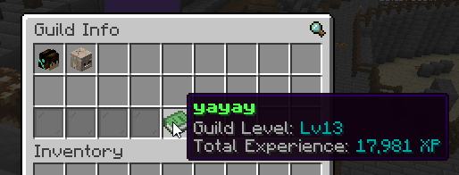

# Features

## Quality of Life

### Bedrock QoL

Bedrock players no longer have an **attack cooldown**.

### Quick Open

Players can now **shift-right-click** to open Ender Chests and Shulker Boxes.

### Instant Brewing

Brewing stands will now instantanously brew potions without fuel.

## Features

### Hardcore Mode

**Hardcore Mode** is an optional challenge which can be enabled with `/hardcore` in-game.
This challenge is *per-player* and does not affect other players.

When enabled, the following changes are made:

- Natural regeneration is disabled
- Environmental damage taken is tripled
- Dying will result in an inventory, ender chest, and experience wipe
- Maximum health is increased to 40HP (20 hearts total)
- Player [debuffs](#armor-debuff) are disabled
- Special reward drops are enabled

This challenge lasts a total of **100 real-life hours** and ***cannot be disabled*** after enabling. You either survive the challenge, or die trying.

Completing hardcore mode will grant the player the following rewards:

- Breaking blocks rewards experience points

### Kamikaze Mode

With the introduction of version 3.0, a new mode was added: **Kamikaze Mode**.
This difficulty is very similar to hardcore mode, but with a few key differences.

In addition to the changes made in Hardcore Mode, the following changes are made:

- You must remain online to pass the time
- Logging out during combat will kill you
- Experience gained is tripled

Instead of *100 real-life hours*, Kamikaze Mode lasts **100 Minecraft Days**.

### New Structures

New structures have been added to the game, including:

The Light Shack

### New Dimensions

New dimensions have been added to the game, including:

- The [**Realm of Light**](#the-realm-of-light)

### Guilds

**Guilds** are a new system to divide players into teams.

Any player can join or leave guilds at any time, with no restrictions.

Guilds can be managed with the following commands:

- `/guild join <name/color>` - Join a guild
  - The first person to join a guild becomes the owner
  - Subsequent players will become `Recruit`s
- `/guild leave` - Leave your current guild
- `/guild disband` - Disband your guild (as the owner)
- `/guild rename <new name>` - Rename your guild (as an officer/owner)
- `/guild bank` - Access your guild-shared "ender chest"
  - This storage is infinite and shared between all guild members
  - The bank can only be accessed at a minimum rank of `Member`
- `/guild info` - Opens a menu with information about the guild & its members
- `/guild split <value>` - Sets the guild-to-player experience split
  - This is used for leveling the guild.
  - `value` is a number between `0` and `100` (inclusive)
- `/guild toggle <list|xpbar>` - Toggles settings relating to guilds
  - `list` will enable/disable the advanced player list
  - `xpbar` will enable/disable the bossbar displaying guild experience progress
- `/guild promote <player> [rank]` - Promote a player to a higher rank
  - `rank` is optional and defaults to the next level
  - The maximum rank is `Officer`
- `/guild demote <player> [rank]` - Demote a player to a lower rank
  - `rank` is optional and defaults to the next level
  - The minimum rank is `Recruit`

> **Note:** Guild colors refer to the internal names of Minecraft's color codes.

#### Screenshots

Guild Info

Guild Bank

### The Atlas

**The Atlas** is a new item which can be used to locate structures.

When right-clicked, it will display a list of structures in the world.
Selecting a structure from the menu will turn the item into a compass pointing towards the structure.

## Overhauls

### Trial Chambers

Trial Chambers have been made more difficult, through the use of **Trial Omen**.

Unlike in vanilla, entering a Trial Chamber with **Trial Omen** will spawn heavily-geared monsters which will do a lot of damage.

The following changes were made for *Ominous Trial Chambers*:

- Block breaking/placing is disabled
  - Exceptions include: TNT and Water
- Natural regeneration is disabled
  - !! *You can only heal with Regeneration or Instant Health!* !!
- Monsters are infinitely stronger
  - Zombmies will spawn with Strength and wield an enchanted Diamond Sword
  - Skeletons will wield an enchanted Bow
  - Spiders will spawn with Speed and Strength
  - ...and more!

### Beacons

Beacons have received an entire overhaul, with new effects and mechanics.

New features include:

- Infinite block storage
- Up to 3 effects at once
  - Effects can be stacked to create effects of potency 3
- Special inner-radius effects
  - Disable mob spawning
  - Disable tool durability
- Upgrades
  - In-radius flight (Flight Crystal)
  - Mass block-breaking (Plot Purger PRO)
  - Teleportation (Eye of Teleportation)
  - Stackable item duplication (Pixel Printer 3000)
  - WorldEdit-like functionality (Builders' Grace)

---

See the recipe to craft an **Advanced Beacon** [here](recipes#advanced-beacon).

### Player List

With the introduction of guilds, the player list was overhauled.

The player list now displays:

- The names of guilds
- The players in guilds
- The online/offline status of players
  - If a player is offline, their last known health is displayed
- Basic server performance metrics
- Information about the server
  - Server name
  - Running My Well Has Run Dry watermark
- (not shown in the screenshot) Information about the *Realm of Light*

### Custom Smithing

With the introduction of [*blasters*](#blasters), a new crafting system was invented.

This menu can be opened by using __Crouch + Right Click__ on a Smithing Table.

## Balancing

### Armor Debuff

When standing near players with similar armor, you will **lose 1 heart** temporarily

Conditions

|                  | Diamond (you)              | Netherite (you) |
|------------------|----------------------------|-----------------|
| Diamond (them)   | Must be wearing a full set | Always affected |
| Netherite (them) | Always affected            | Always affected |

## Content

### The Realm of Light

The *Realm of Light* is a new dimension which resets every hour.

To light the portal, you must use **The Atlas** on a 3x2 glowstone frame.

What awaits inside is a challenge for you, good luck!

### Blasters

A new set of weapons have been introduced: **blasters**!

They are crafted using a [*Smithing Table*](#custom-smithing) and materials.

|         Blaster         |     Base Damage     |   Critical Damage    |     Fire Rate     |     Ammo Item     | Ammo per Item | Reload Time | Per Magazine |   Range    |
|-------------------------|---------------------|----------------------|-------------------|-------------------|---------------|-------------|--------------|------------|
| Test Gun                | 28                  | 56                   | 1 tick            | Medium Crystal    |             1 | 5 ticks     |          100 | 20 blocks  |
| Turf Blaster            | 13                  | 26                   | 5 ticks           | Light Crystal     |             1 | 10 ticks    |           16 | 11 blocks  |
| Prototype Launcher 3000 | 18                  | 36                   | 3 ticks           | Medium Crystal    |             1 | 20 ticks    |           27 | 18 blocks  |
| Frenzy                  | 6                   | 12                   | 0 ticks (instant) | Light Crystal     |             3 | 10 ticks    |           40 | 5 blocks   |
| OPERATOR 400            | 100 (30 to players) | 800 (240 to players) | 75 ticks          | Heavy Crystal     |             6 | 30 ticks    |            6 | 500 blocks |
| The Minecart            | 30                  | 60                   | 0 ticks           | Explosive Crystal |             1 | 60 ticks    |            1 | 500 blocks |
