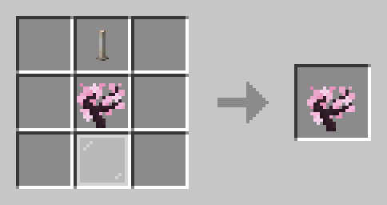

# Recipes

## Minecraft

### Enchanted Golden Apple

### Totem of Undying

## My Well Has Run Dry

### Restie's Blossom Sapling

### Advanced Beacon

> The **Beacon** at the bottom is a normal beacon, while the result is an **Advanced Beacon**.
> The **Monster Spawner** can be obtained from opening **Ominous Vaults**.

### Enlightened Diamond Armor

#### Upgrades

> This upgrade applies to all pieces of **Enlightened Diamond Armor**.

---

> The resulting item is actually a blue-ish dyed piece of Leather Armor that can be upgraded.

> The **Light Gray Dye** is actually a **Soul of Light** dropped from defeating the boss at the top of the **Realm of Light**.

### Enlightened Diamond Sword

#### Upgrades

> The resulting item is actually an Iron Sword that can be upgraded.

---

> The **Light Gray Dye** is actually a **Soul of Light** dropped from defeating the boss at the top of the **Realm of Light**.